# Diagrams

This document contains all Mermaid diagrams for Adirstat, covering architecture, data flows, and state machines.

---

## Diagram Index

1. [ER Diagram](#1-entity-relationship-diagram)
2. [App Flowchart](#2-app-flowchart)
3. [Class Diagram: Core Domain](#3-class-diagram-core-domain)
4. [Class Diagram: Architecture Layers](#4-class-diagram-architecture-layers)
5. [Sequence Diagram: Scan Initiation](#5-sequence-diagram-scan-initiation)
6. [Sequence Diagram: Treemap Interaction](#6-sequence-diagram-treemap-interaction)
7. [State Machine: Scan States](#7-state-machine-scan-states)
8. [Package Diagram](#8-package-diagram)
9. [Data Flow: File Deletion](#9-data-flow-file-deletion)
10. [Data Flow: Export to CSV](#10-data-flow-export-to-csv)
11. [Navigation Diagram](#11-navigation-diagram)
12. [Permission Flow](#12-permission-flow)
13. [Treemap Layout Algorithm](#13-treemap-layout-algorithm)

---

## 1. Entity Relationship Diagram

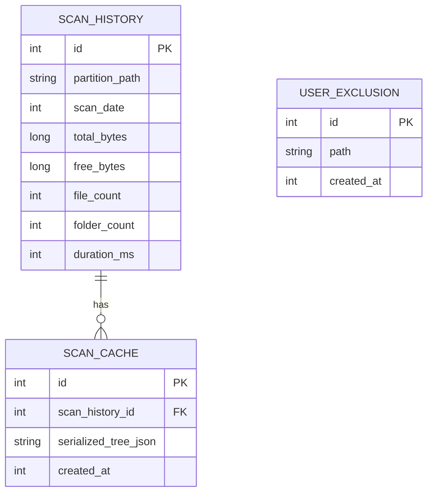

---

## 2. App Flowchart

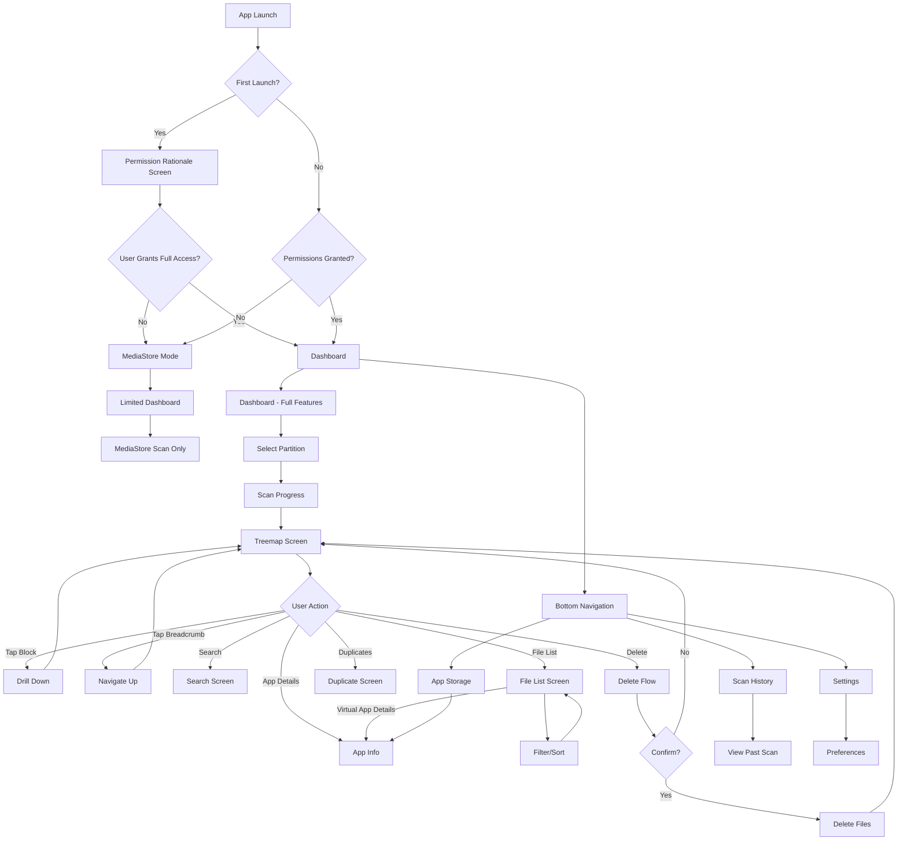

---

## 3. Class Diagram: Core Domain

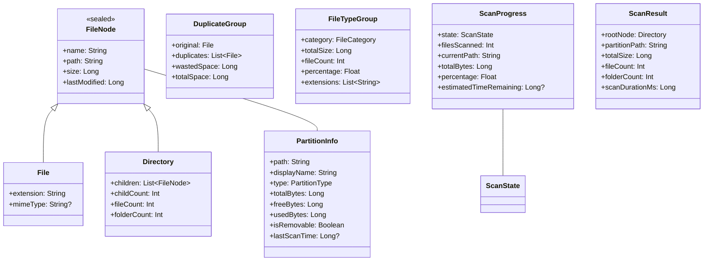

---

## 4. Class Diagram: Architecture Layers

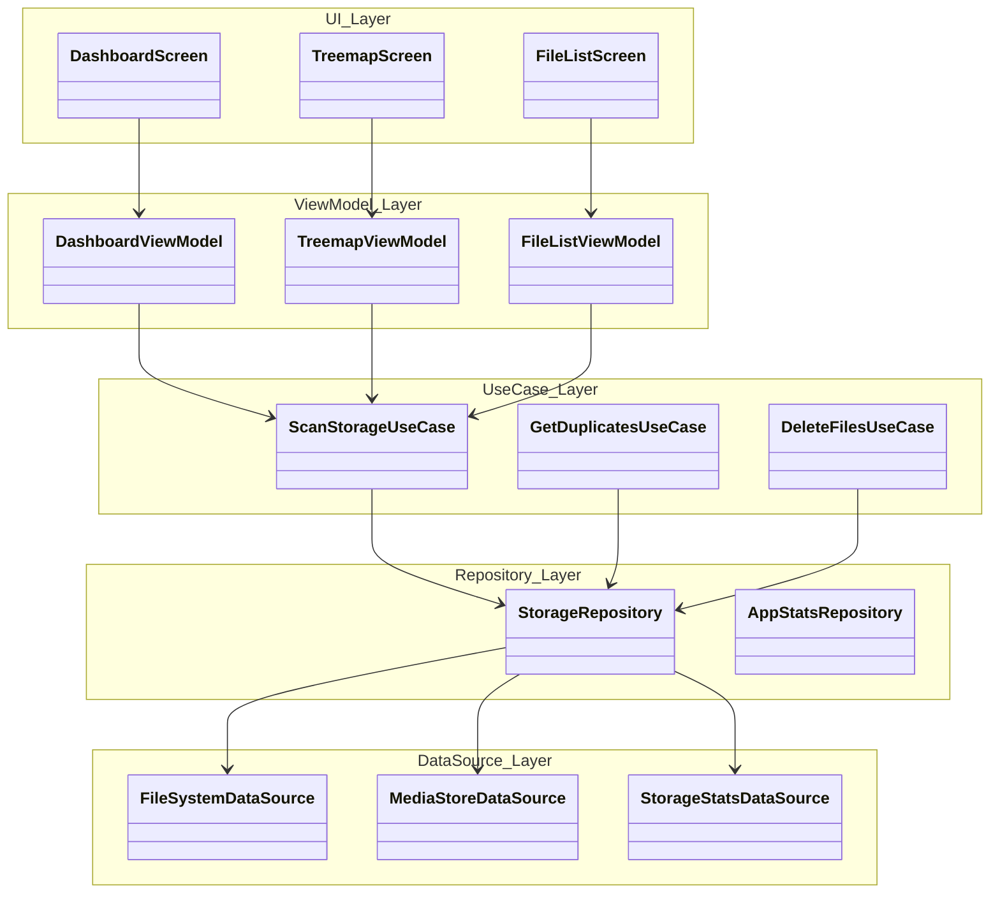

---

## 5. Sequence Diagram: Scan Initiation

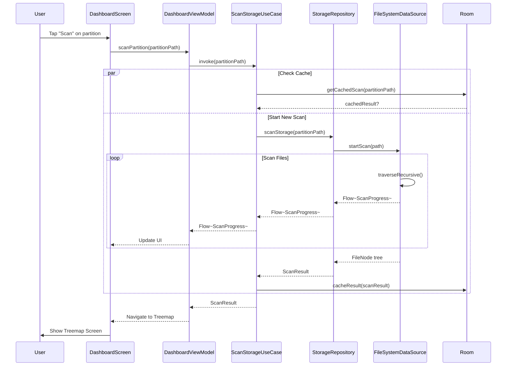

---

## 6. Sequence Diagram: Treemap Interaction

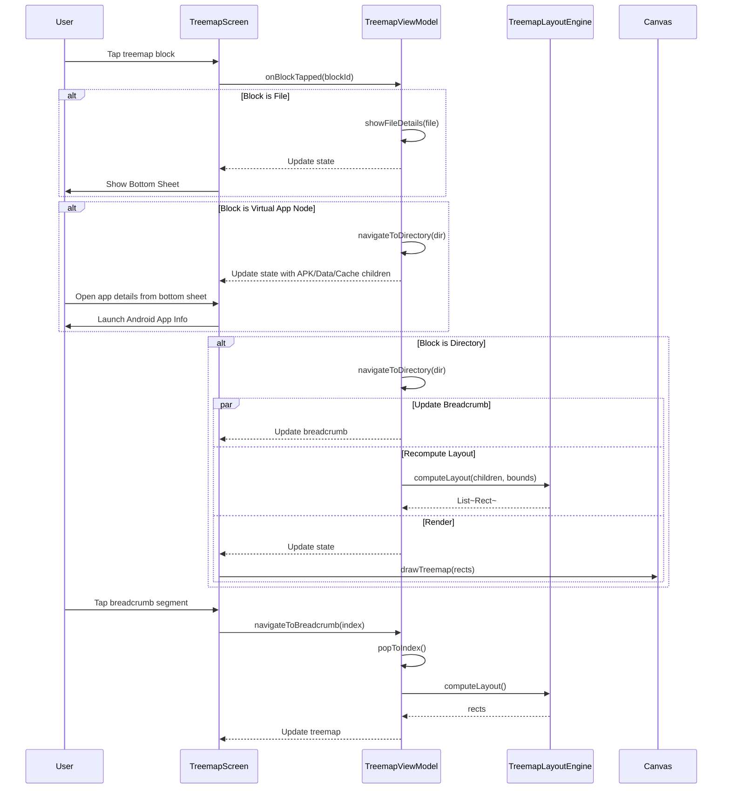

---

## 7. State Machine: Scan States

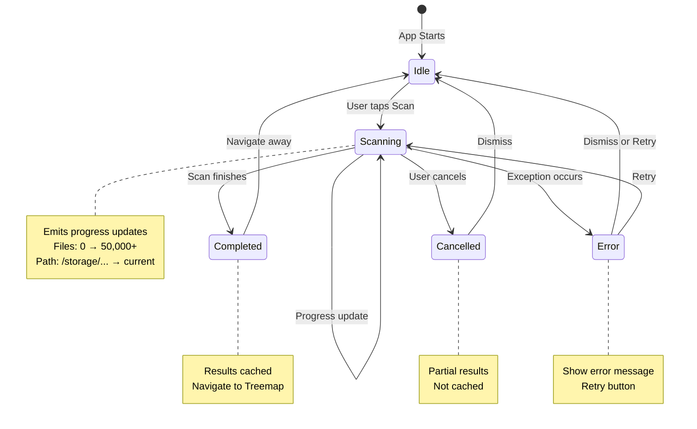

---

## 8. Package Diagram

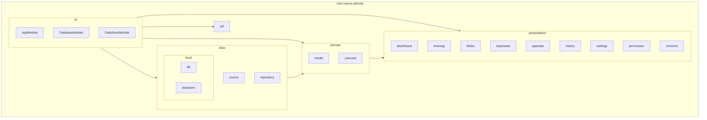

---

## 9. Data Flow: File Deletion

```mermaid
flowchart TD
    A[User selects file(s) to delete] --> B[Show confirmation dialog]
    B --> C{User confirms?}
    
    C -->|No| D[Cancel and return]
    C -->|Yes| E{Full Access?}
    
    E -->|Yes| F[Use File API]
    E -->|No| G[Use MediaStore API]
    
    F --> H[file.delete()]
    G --> I[contentResolver.delete(uri)]
    
    H --> J{Delete successful?}
    I --> J
    
    J -->|Yes| K[Update UI]
    J -->|No| L[Show error toast]
    
    K --> M[Remove from treemap/list]
    M --> N[Recalculate sizes]
    
    L --> O[Show error message]
    
    N --> P[Navigate back or stay]
```

---

## 10. Data Flow: Export to CSV

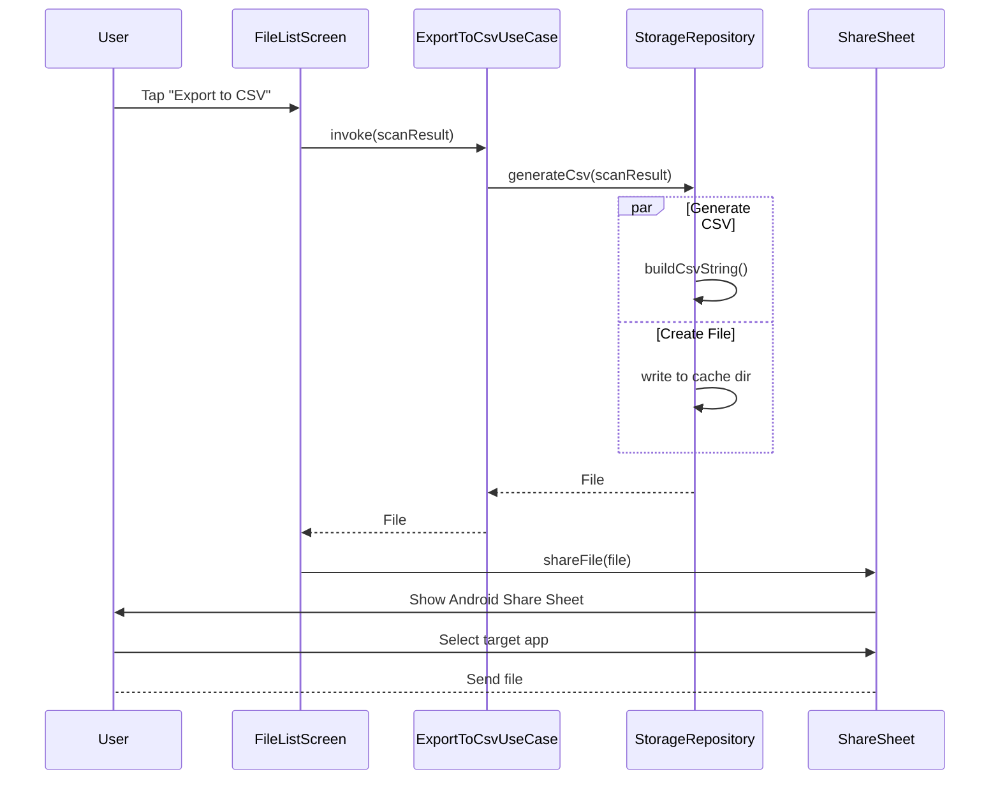

---

## 11. Navigation Diagram

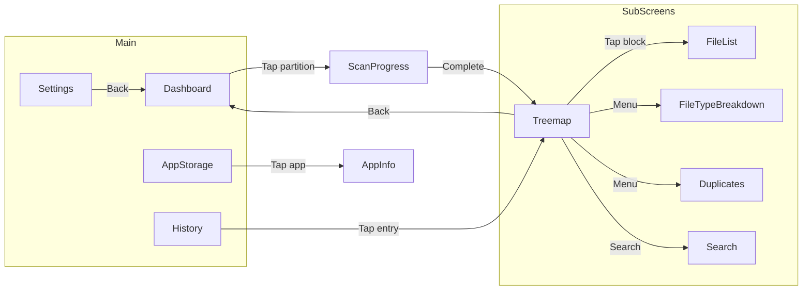

---

## 12. Permission Flow

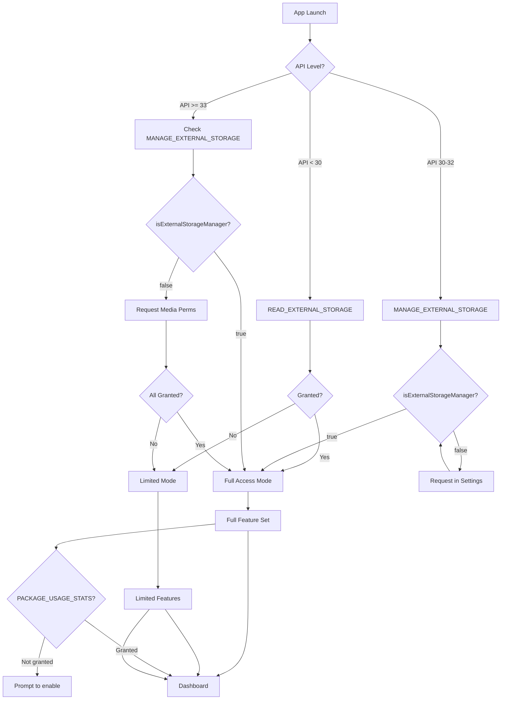

---

## 13. Treemap Layout Algorithm

```mermaid
flowchart TD
    A[Input: List of items with sizes] --> B[Sort by size descending]
    B --> C[Initialize container bounds]
    C --> D[Calculate total size]
    
    D --> E{Total items > 0?}
    E -->|No| F[Return empty]
    
    E -->|Yes| G[Start row]
    
    G --> H{More items?}
    H -->|No| I[Layout final row]
    H -->|Yes| J[Add next item to row]
    
    J --> K{Aspect ratio improves?}
    K -->|Yes| H
    K -->|No| L[Remove last item]
    
    L --> M{Layout current row}
    M --> N[Alternating horizontal/vertical]
    N --> O[Update remaining bounds]
    O --> H
    
    I --> P[Return rectangles]
    
    subgraph "Aspect Ratio Calculation"
        Q[For each item in row]
        R[Calculate: max(w/h, h/w)]
        S[Find worst ratio in row]
    end
    
    J -.-> Q
    K -.-> R
    S -.-> K
```

---

## Summary

| Diagram | Type | Purpose |
|---------|------|---------|
| ER Diagram | Entity Relationship | Database schema |
| App Flowchart | Flowchart | User journey |
| Class Diagram (Core) | UML Class | Domain models |
| Class Diagram (Layers) | UML Class | Architecture |
| Scan Initiation | Sequence | Scan flow |
| Treemap Interaction | Sequence | UI interaction |
| Scan States | State Machine | State management |
| Package Diagram | Graph | Module organization |
| File Deletion | Flowchart | Delete flow |
| Export to CSV | Sequence | Export flow |
| Navigation | Flowchart | Screen navigation |
| Permission Flow | Flowchart | Permission handling |
| Treemap Algorithm | Flowchart | Algorithm steps |
