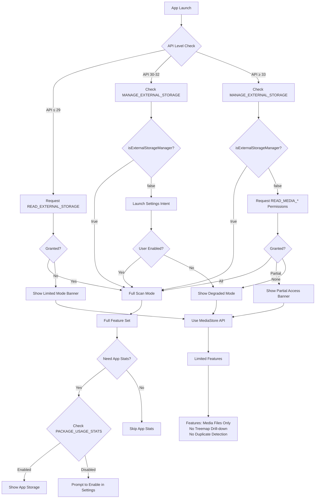

# Permissions Documentation

> This document details all Android permissions required by Adirstat, their purpose, API level handling, and compliance notes for Google Play Store and F-Droid distribution.

---

## Permission Overview

| Permission | Purpose | API Level | Type | Denied Behavior |
|------------|---------|-----------|------|-----------------|
| `READ_EXTERNAL_STORAGE` | Read files on external storage | API < 33 | Runtime | Cannot scan files via File API |
| `WRITE_EXTERNAL_STORAGE` | Write to external storage | API < 30 | Runtime | No effect on API 30+ (documented below) |
| `MANAGE_EXTERNAL_STORAGE` | Full file system access | API 30+ | Special | Cannot scan non-media files, treemap limited to MediaStore data |
| `READ_MEDIA_IMAGES` | Read image file metadata | API 33+ | Runtime | Cannot see image files in limited mode |
| `READ_MEDIA_VIDEO` | Read video file metadata | API 33+ | Runtime | Cannot see video files in limited mode |
| `READ_MEDIA_AUDIO` | Read audio file metadata | API 33+ | Runtime | Cannot see audio files in limited mode |
| `READ_MEDIA_VISUAL_USER_SELECTED` | Partial media access | API 34+ | Runtime | Photo picker fallback on API 34+ |
| `PACKAGE_USAGE_STATS` | Query app storage sizes | All | Special | Cannot show per-app storage breakdown |
| `QUERY_ALL_PACKAGES` | List all installed apps | All | Manifest | Only see some apps in list |
| `REQUEST_DELETE_PACKAGES` | Request file deletion | API 30+ | Runtime | Must use system file manager for deletion |

---

## Permission Details

### READ_EXTERNAL_STORAGE (API < 33)

```xml
<uses-permission android:name="android.permission.READ_EXTERNAL_STORAGE"
    android:maxSdkVersion="32" />
```

- **Purpose:** Legacy permission to read files on external storage
- **Type:** Runtime permission (must request at runtime)
- **Required:** Only on API 29 and below (deprecated on API 33+)
- **If Denied:** App enters degraded mode using MediaStore API

### WRITE_EXTERNAL_STORAGE (API < 30)

```xml
<uses-permission android:name="android.permission.WRITE_EXTERNAL_STORAGE"
    android:maxSdkVersion="29" />
```

- **Purpose:** Intended for writing to external storage
- **Type:** Runtime permission
- **⚠️ Important:** On API 30+, this permission has **NO EFFECT**. Android 11+ uses scoped storage, and MANAGE_EXTERNAL_STORAGE is required for full file access.
- **If Denied:** Not applicable (no effect on API 30+)

### MANAGE_EXTERNAL_STORAGE (API 30+)

```xml
<uses-permission android:name="android.permission.MANAGE_EXTERNAL_STORAGE"
    tools:ignore="ScopedStorage" />
```

- **Purpose:** Provides full read/write access to all files on external storage, equivalent to a file manager
- **Type:** Special permission (enabled via Settings, not runtime request)
- **Check:** `Environment.isExternalStorageManager()`
- **If Denied:** App uses MediaStore fallback with limited results
- **Play Store:** Requires Permissions Declaration Form (see compliance section)

### READ_MEDIA_IMAGES (API 33+)

```xml
<uses-permission android:name="android.permission.READ_MEDIA_IMAGES" />
```

- **Purpose:** Access image file metadata via MediaStore
- **Type:** Runtime permission
- **If Denied:** Images not shown in MediaStore fallback mode

### READ_MEDIA_VIDEO (API 33+)

```xml
<uses-permission android:name="android.permission.READ_MEDIA_VIDEO" />
```

- **Purpose:** Access video file metadata via MediaStore
- **Type:** Runtime permission
- **If Denied:** Videos not shown in MediaStore fallback mode

### READ_MEDIA_AUDIO (API 33+)

```xml
<uses-permission android:name="android.permission.READ_MEDIA_AUDIO" />
```

- **Purpose:** Access audio file metadata via MediaStore
- **Type:** Runtime permission
- **If Denied:** Audio files not shown in MediaStore fallback mode

### READ_MEDIA_VISUAL_USER_SELECTED (API 34+)

```xml
<uses-permission android:name="android.permission.READ_MEDIA_VISUAL_USER_SELECTED" />
```

- **Purpose:** Partial media access for Android 14+ photo picker
- **Type:** Runtime permission
- **If Denied:** Falls back to no media access
- **Note:** Allows users to grant access to specific media without granting all

### PACKAGE_USAGE_STATS

```xml
<uses-permission android:name="android.permission.PACKAGE_USAGE_STATS"
    tools:ignore="ProtectedPermissions" />
```

- **Purpose:** Query installed app sizes via StorageStatsManager (APK + data + cache)
- **Type:** Special permission (no runtime request; user must enable in Settings)
- **Check:** `AppOpsManager.noteOp()` before using StorageStatsManager
- **If Denied:** Per-app storage stats feature disabled
- **Settings Path:** Settings > Apps > Special App Access > Usage access

### QUERY_ALL_PACKAGES

```xml
<uses-permission android:name="android.permission.QUERY_ALL_PACKAGES"
    tools:ignore="QueryAllPackagesPermission" />
```

- **Purpose:** List all installed apps on the device (required for per-app storage feature)
- **Type:** Manifest permission (no runtime request)
- **If Denied:** Only visible apps shown in list
- **Play Store:** Requires Permissions Declaration Form (see compliance section)

### REQUEST_DELETE_PACKAGES

```xml
<uses-permission android:name="android.permission.REQUEST_DELETE_PACKAGES" />
```

- **Purpose:** Request deletion of specific files via system dialog
- **Type:** Runtime permission
- **If Denied:** Must use MediaStore delete API instead

---

## Permission Request Flow



---

## Degraded Mode Behavior

| Feature | Full Access Mode | MediaStore Only Mode |
|---------|------------------|---------------------|
| Partition Enumeration | ✅ All volumes (internal/SD/OTG) | ✅ Only primary external |
| Storage Stats (used/free/total) | ✅ Accurate via StatFs | ✅ Via StorageStatsManager |
| Recursive File Scan | ✅ Full File API traversal | ❌ MediaStore query only |
| Treemap Visualization | ✅ All files + folders | ⚠️ Media files only |
| Drill-Down Navigation | ✅ Full folder tree | ❌ Flat list only |
| Large Files List | ✅ All files | ⚠️ Media files only |
| File Type Breakdown | ✅ Complete by extension | ⚠️ By media category only |
| Duplicate Detection | ✅ By name+size+MD5 | ❌ Not available |
| Per-App Storage | ✅ Via StorageStatsManager | ❌ Not available |
| Delete Files | ✅ Direct delete | ⚠️ Via MediaStore only |
| Export to CSV | ✅ Complete tree | ⚠️ Media files only |

---

## Code Patterns

### Checking MANAGE_EXTERNAL_STORAGE

```kotlin
object PermissionManager {
    
    fun hasFullStorageAccess(): Boolean {
        return if (Build.VERSION.SDK_INT >= Build.VERSION_CODES.R) {
            Environment.isExternalStorageManager()
        } else {
            // On API < 30, we use legacy permissions
            true
        }
    }
    
    fun requestFullStorageAccess(context: Context) {
        if (Build.VERSION.SDK_INT >= Build.VERSION_CODES.R) {
            val intent = Intent(Settings.ACTION_MANAGE_ALL_FILES_ACCESS_PERMISSION).apply {
                data = Uri.parse("package:${context.packageName}")
            }
            context.startActivity(intent)
        }
    }
}
```

### Checking PACKAGE_USAGE_STATS

```kotlin
object PermissionManager {
    
    fun hasUsageStatsPermission(context: Context): Boolean {
        val appOps = context.getSystemService(Context.APP_OPS_SERVICE) as AppOpsManager
        val mode = appOps.checkOpNoThrow(
            AppOpsManager.OPSTR_GET_USAGE_STATS,
            android.os.Process.myUid(),
            context.packageName
        )
        return mode == AppOpsManager.MODE_ALLOWED
    }
    
    fun requestUsageStatsPermission(context: Context) {
        val intent = Intent(Settings.ACTION_USAGE_ACCESS_SETTINGS).apply {
            data = Uri.parse("package:${context.packageName}")
        }
        context.startActivity(intent)
    }
}
```

### Requesting Media Permissions (API 33+)

```kotlin
object PermissionManager {
    
    fun getMediaPermissions(): Array<String> {
        return if (Build.VERSION.SDK_INT >= Build.VERSION_CODES.TIRAMISU) {
            arrayOf(
                Manifest.permission.READ_MEDIA_IMAGES,
                Manifest.permission.READ_MEDIA_VIDEO,
                Manifest.permission.READ_MEDIA_AUDIO
            )
        } else {
            arrayOf(Manifest.permission.READ_EXTERNAL_STORAGE)
        }
    }
    
    fun hasMediaPermissions(context: Context): Boolean {
        return getMediaPermissions().all { 
            ContextCompat.checkSelfPermission(context, it) == PackageManager.PERMISSION_GRANTED
        }
    }
}
```

---

## WRITE_EXTERNAL_STORAGE API 30+ Note

On Android 11 (API 30) and later, `WRITE_EXTERNAL_STORAGE` has **no effect** when granted. The permission is ignored by the system because Android moved to scoped storage. 

**Why we still declare it:**
- Required for backward compatibility with API < 30
- Used in conjunction with `android:maxSdkVersion="29"` to ensure it only applies where relevant

**What to use instead:**
- For full file access: `MANAGE_EXTERNAL_STORAGE`
- For media access: `READ_MEDIA_IMAGES/VIDEO/AUDIO` (API 33+)
- For limited file operations: `MediaStore` ContentProvider

---

## Google Play Store Compliance

### MANAGE_EXTERNAL_STORAGE

Google Play requires a **Permissions Declaration Form** for apps using `MANAGE_EXTERNAL_STORAGE`. This is a mandatory policy requirement.

**Justification for Adirstat:**
- Adirstat is a **file manager**-type app that needs to access all files on the device
- The permission is essential for the app's core functionality (scanning all files and folders)
- The app does NOT upload any data — it's fully offline
- The app clearly explains the permission to users

**Play Store Policy:**
- Must complete the Permissions Declaration Form in Play Console
- Must provide a video demonstrating the need for the permission
- Must explain how the permission is used in the app's description

### QUERY_ALL_PACKAGES

Google Play requires a **Permissions Declaration Form** for `QUERY_ALL_PACKAGES` as well.

**Justification for Adirstat:**
- Required to list ALL installed apps for the per-app storage feature
- Without this permission, system apps and some third-party apps would be hidden
- This is necessary to provide accurate per-app storage statistics

**Play Store Policy:**
- Must declare the app does not use this permission for prohibited purposes
- Must explain the feature that requires this permission (app storage breakdown)

---

## F-Droid Compliance

F-Droid accepts both `MANAGE_EXTERNAL_STORAGE` and `QUERY_ALL_PACKAGES` permissions for file manager use cases.

**Justification for F-Droid:**
- Adirstat is a legitimate file storage analyzer
- Permissions are declared with clear, legitimate purposes
- No network permissions = no data exfiltration possible
- Source code will be provided for F-Droid build

**Note:** F-Droid builds are tag-based. See Fastlane documentation for release process.

---

## Permission Summary for Users

When users ask "Why do you need this?":

| Permission | User Explanation |
|------------|------------------|
| MANAGE_EXTERNAL_STORAGE | "To see ALL files on your device, just like WizTree on Windows. Without this, we can only see media files (photos, music, videos)." |
| READ_MEDIA_* | "To show your photos, videos, and music even if you don't grant full access." |
| PACKAGE_USAGE_STATS | "To show how much space each installed app is using (APK, data, and cache)." |
| QUERY_ALL_PACKAGES | "To list all apps so you can see storage usage for each one, including system apps." |

---

## Files Affected by Permission Changes

| Permission Change | Files to Update |
|-------------------|-----------------|
| New permission added | AndroidManifest.xml, PERMISSIONS.md, SRS.md (new FR-* if applicable) |
| Permission removed | AndroidManifest.xml, PERMISSIONS.md, PermissionManager.kt, any affected UseCase |
| API level logic changed | PermissionManager.kt, PERMISSIONS.md (flowchart), UI screens if degraded mode UI changes |
| Play Store policy change | PERMISSIONS.md (compliance section), Play Console |
