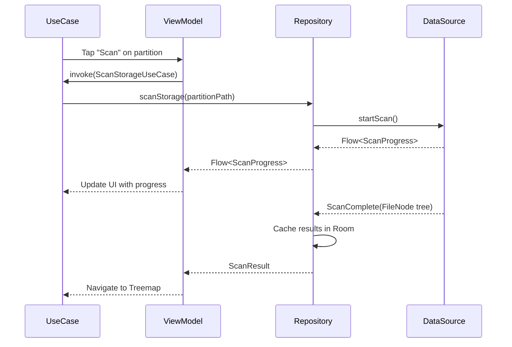

# Software Design Document (SDD)

---

## 1. Introduction

### 1.1 Purpose
This document provides the detailed software architecture and technical design for Adirstat, an Android disk space analyzer application.

### 1.2 Scope
This SDD covers:
- Overall architecture (MVVM + Clean Architecture)
- Package structure
- Data layer design (Room, DataStore, DataSources)
- Domain layer design (Models, Repositories, UseCases)
- Presentation layer design (Compose Screens, ViewModels)
- Key algorithms (Treemap, Duplicate Detection)
- Database schema

---

## 2. Architecture

### 2.1 Overall Architecture

```
┌─────────────────────────────────────────────────────────────┐
│                      UI Layer (Compose Screens)            │
│  Dashboard | Treemap | FileList | Duplicates | AppStats    │
└─────────────────────────────────────────────────────────────┘
                              ↓
┌─────────────────────────────────────────────────────────────┐
│                   ViewModel Layer (StateFlow)               │
│  DashboardViewModel | TreemapViewModel | FileListViewModel │
└─────────────────────────────────────────────────────────────┘
                              ↓
┌─────────────────────────────────────────────────────────────┐
│                    UseCase Layer (Clean)                    │
│  ScanStorageUseCase | GetDuplicatesUseCase | GetFileType...│
└─────────────────────────────────────────────────────────────┘
                              ↓
┌─────────────────────────────────────────────────────────────┐
│                  Repository Layer (Interface)               │
│  StorageRepository | AppStatsRepository | ScanHistoryRepo │
└─────────────────────────────────────────────────────────────┘
                              ↓
┌─────────────────────────────────────────────────────────────┐
│                     Data Sources Layer                      │
│  FileSystemDataSource | MediaStoreDataSource | StorageStats│
└─────────────────────────────────────────────────────────────┘
                              ↓
┌─────────────────────────────────────────────────────────────┐
│                    Local Storage Layer                      │
│         Room Database | DataStore Preferences               │
└─────────────────────────────────────────────────────────────┘
```

### 2.2 Architecture Pattern
- **MVVM (Model-View-ViewModel)** for presentation layer
- **Clean Architecture** with UseCase layer for business logic
- **Repository Pattern** for data abstraction
- **Single Source of Truth** via Room database

### 2.3 Technology Stack

| Layer | Technology |
|-------|------------|
| UI | Jetpack Compose + Material 3 |
| DI | Hilt |
| Navigation | Navigation Compose |
| State | Kotlin StateFlow + SharedFlow |
| Async | Kotlin Coroutines |
| Database | Room |
| Preferences | DataStore |
| Background | WorkManager |
| Testing | JUnit, MockK |

---

## 3. Package Structure

```
com.ivarna.adirstat/
├── di/                                    # Hilt dependency injection
│   ├── AppModule.kt                       # App-level dependencies
│   ├── DatabaseModule.kt                   # Room database setup
│   └── DataStoreModule.kt                 # DataStore setup
│
├── data/
│   ├── local/
│   │   ├── db/
│   │   │   ├── AdirstatDatabase.kt        # Room database
│   │   │   ├── dao/
│   │   │   │   ├── ScanHistoryDao.kt
│   │   │   │   ├── ScanCacheDao.kt
│   │   │   │   └── UserExclusionDao.kt
│   │   │   └── entity/
│   │   │       ├── ScanHistoryEntity.kt
│   │   │       ├── ScanCacheEntity.kt
│   │   │       └── UserExclusionEntity.kt
│   │   └── datastore/
│   │       └── PreferencesDataStore.kt   # User preferences
│   │
│   ├── source/
│   │   ├── FileSystemDataSource.kt        # File API scan (visible files)
│   │   ├── MediaStoreDataSource.kt        # MediaStore image/video/audio totals for dashboard
│   │   ├── StorageStatsDataSource.kt      # StorageStatsManager for accurate partition & app stats
│   │   ├── AppStatsDataSource.kt          # Per-app APK sizes via PackageManager
│   │   └── VirtualNodeBuilder.kt          # Treemap-only virtual app-data nodes from StorageStatsManager
│   │
│   └── repository/
│       ├── StorageRepositoryImpl.kt
│       ├── AppStatsRepositoryImpl.kt
│       ├── ScanHistoryRepositoryImpl.kt
│       └── PreferencesRepositoryImpl.kt
│
├── domain/
│   ├── model/
│   │   ├── FileNode.kt                    # Sealed class: File/Directory
│   │   ├── PartitionInfo.kt               # Storage volume info
│   │   ├── DuplicateGroup.kt              # Duplicate files group
│   │   ├── FileTypeGroup.kt               # File type breakdown
│   │   ├── AppStorageInfo.kt              # Per-app storage
│   │   ├── ScanProgress.kt                # Scan progress state
│   │   └── ScanResult.kt                  # Complete scan result
│   │
│   ├── repository/
│   │   ├── StorageRepository.kt          # Interface
│   │   ├── AppStatsRepository.kt          # Interface
│   │   ├── ScanHistoryRepository.kt       # Interface
│   │   └── PreferencesRepository.kt       # Interface
│   │
│   └── usecase/
│       ├── ScanStorageUseCase.kt
│       ├── GetTreemapDataUseCase.kt
│       ├── GetDuplicatesUseCase.kt
│       ├── GetFileTypeBreakdownUseCase.kt
│       ├── GetLargeFilesUseCase.kt
│       ├── DeleteFilesUseCase.kt
│       ├── ExportToCsvUseCase.kt
│       ├── GetAppStorageUseCase.kt
│       └── GetScanHistoryUseCase.kt
│
├── presentation/
│   ├── common/
│   │   ├── components/
│   │   │   ├── AppDetailsShortcutCard.kt  # Reusable virtual app-settings shortcut card
│   │   │   ├── StorageBar.kt              # Usage bar component
│   │   │   └── FileTypeIcon.kt            # File type icons
│   │   └── theme/
│   │       ├── Color.kt                   # App colors
│   │       ├── Type.kt                    # Typography
│   │       └── Theme.kt                   # Material 3 theme
│   │
│   ├── dashboard/
│   │   ├── DashboardScreen.kt
│   │   └── DashboardViewModel.kt
│   │
│   ├── treemap/
│   │   ├── TreemapScreen.kt
│   │   ├── TreemapViewModel.kt
│   │   └── TreemapCanvas.kt               # Canvas rendering
│   │
│   ├── filelist/
│   │   ├── FileListScreen.kt
│   │   └── FileListViewModel.kt
│   │
│   ├── duplicates/
│   │   ├── DuplicatesScreen.kt
│   │   └── DuplicatesViewModel.kt
│   │
│   ├── appstats/
│   │   ├── AppStatsScreen.kt
│   │   └── AppStatsViewModel.kt
│   │
│   ├── history/
│   │   ├── HistoryScreen.kt
│   │   └── HistoryViewModel.kt
│   │
│   ├── settings/
│   │   ├── SettingsScreen.kt
│   │   └── SettingsViewModel.kt
│   │
│   ├── permission/
│   │   ├── PermissionScreen.kt
│   │   └── PermissionViewModel.kt
│   │
│   └── navigation/
│       └── NavGraph.kt                    # Navigation setup
│
├── util/
│   ├── PermissionManager.kt              # Multi-API permission logic
│   ├── FileSizeFormatter.kt               # Size formatting utilities
│   ├── TreemapLayoutEngine.kt            # Squarified algorithm
│   ├── FileTypeIconMapper.kt              # Extension → icon mapping
│   └── DuplicateDetector.kt               # Duplicate detection logic
│
└── AdirstatApplication.kt                # Application class
```

---

## 4. Domain Models

### 4.1 FileNode (Sealed Class)

```kotlin
sealed class FileNode {
    abstract val name: String
    abstract val path: String
    abstract val sizeBytes: Long
    abstract val lastModified: Long
    abstract val isVirtual: Boolean
    abstract val virtualLabel: String?

    data class File(
        override val name: String,
        override val path: String,
        override val sizeBytes: Long,
        override val lastModified: Long,
        override val isVirtual: Boolean = false,
        override val virtualLabel: String? = null,
        val extension: String,
        val mimeType: String = ""
    ) : FileNode()

    data class Directory(
        override val name: String,
        override val path: String,
        override val sizeBytes: Long,
        override val lastModified: Long,
        override val isVirtual: Boolean = false,
        override val virtualLabel: String? = null,
        val children: List<FileNode> = emptyList(),
        val isRestricted: Boolean = false
    ) : FileNode()
}
```

`isVirtual=true` is reserved for treemap-only app-data nodes created from `StorageStatsManager`. Root filesystem scans stored in cache contain only real on-disk folders.

### 4.2 PartitionInfo

```kotlin
data class PartitionInfo(
    val path: String,
    val displayName: String,
    val type: PartitionType,  // INTERNAL, SD_CARD, USB_OTG
    val totalBytes: Long,
    val freeBytes: Long,
    val usedBytes: Long,
    val isRemovable: Boolean,
    val lastScanTime: Long? = null
)
```

### 4.3 DuplicateGroup

```kotlin
data class DuplicateGroup(
    val original: FileNode.File,
    val duplicates: List<FileNode.File>,
    val wastedSpace: Long,  // (count - 1) * fileSize
    val totalSpace: Long     // count * fileSize
)
```

### 4.4 FileTypeGroup

```kotlin
data class FileTypeGroup(
    val category: FileCategory,  // IMAGES, VIDEO, AUDIO, DOCUMENTS, ARCHIVES, CODE, OTHER
    val totalSize: Long,
    val fileCount: Int,
    val percentage: Float,
    val extensions: List<String>
)
```

### 4.5 ScanProgress

```kotlin
data class ScanProgress(
    val state: ScanState,       // IDLE, SCANNING, COMPLETED, ERROR, CANCELLED
    val filesScanned: Int = 0,
    val currentPath: String = "",
    val totalBytes: Long = 0,
    val percentage: Float = 0f,
    val estimatedTimeRemaining: Long? = null,  // milliseconds
    val error: String? = null
)
```

---

## 5. Data Layer Design

### 5.1 Room Database Schema

#### scan_history Table
| Column | Type | Description |
|--------|------|-------------|
| id | INTEGER (PK) | Auto-increment ID |
| partition_path | TEXT | Path to partition (e.g., /storage/emulated/0) |
| scan_date | INTEGER | Timestamp of scan |
| total_bytes | INTEGER | Total partition size |
| free_bytes | INTEGER | Free space at scan time |
| file_count | INTEGER | Number of files scanned |
| folder_count | INTEGER | Number of folders scanned |
| duration_ms | INTEGER | Scan duration in milliseconds |

#### scan_cache Table
| Column | Type | Description |
|--------|------|-------------|
| id | INTEGER (PK) | Auto-increment ID |
| scan_history_id | INTEGER (FK) | Reference to scan_history |
| serialized_tree_json | TEXT | JSON-serialized FileNode tree |
| created_at | INTEGER | Cache creation timestamp |

#### user_exclusions Table
| Column | Type | Description |
|--------|------|-------------|
| id | INTEGER (PK) | Auto-increment ID |
| path | TEXT | Excluded path string |
| created_at | INTEGER | When exclusion was added |

### 5.2 DataStore Preferences Schema

| Key | Type | Default | Description |
|-----|------|---------|-------------|
| theme_mode | String | "system" | system/light/dark/dynamic |
| min_file_size_bytes | Long | 0L | Minimum file size for display |
| auto_scan_enabled | Boolean | false | Enable background scan |
| auto_scan_interval_days | Int | 7 | Days between auto scans |
| last_opened_partition | String? | null | Last scanned partition |

---

## 6. Key Technical Decisions

### 6.1 Treemap Algorithm: Squarified Treemap

The app implements the **Squarified Treemap** algorithm (Ben Shneiderman, 2000) as a pure Kotlin function:

**Algorithm Steps:**
1. Start with a list of items sorted by size (descending)
2. Calculate the aspect ratio of each potential layout
3. Place items in rows, minimizing aspect ratio variance
4. Alternate layout direction (horizontal/vertical)
5. Return rectangles with (x, y, width, height) coordinates

**Key Properties:**
- Aspect ratios close to 1:1 (square-ish)
- O(n log n) time complexity for n items
- Pure function, no side effects
- Unit testable

**Implementation notes:**
- Nodes are always sorted by `sizeBytes` descending before layout
- The layout engine minimizes the worst aspect ratio of each row before recursing into the remaining bounds
- Root-level treemap rendering is capped to `MAX_ROOT_NODES = 20`; remaining nodes are folded into an `Others (N)` node
- Any node whose estimated canvas area falls below roughly `48dp × 32dp` is grouped into an `Others` aggregate before drawing

### 6.2 Treemap Rendering: Compose Canvas

The treemap is rendered using Compose's `Canvas` API:
- No third-party chart libraries
- Full control over colors, gestures, animations
- Hardware-accelerated drawing

### 6.3 Scanning with Coroutines + Flow

```kotlin
// Scanning emits progress via Flow
fun scanStorage(path: String): Flow<ScanProgress> = flow {
    // Emit initial state
    emit(ScanProgress(state = ScanState.SCANNING, ...))
    
    // Recursive scan with progress updates
    scanRecursive(path) { progress ->
        emit(progress)
    }
    
    // Emit completion
    emit(ScanProgress(state = ScanState.COMPLETED, ...))
}.flowOn(Dispatchers.IO)
```

### 6.4 Duplicate Detection: Two-Pass Algorithm

**Pass 1 (Fast):** Group by (filename, size)
- O(n) time complexity
- High accuracy for exact duplicates

**Pass 2 (Optional):** MD5 hash comparison
- Only runs on candidates from Pass 1
- Configurable (on/off by user)
- More accurate but slower

### 6.5 Permission Handling Strategy

The app handles permissions differently based on API level:

| API Level | Strategy |
|-----------|----------|
| ≤ 29 | Request READ_EXTERNAL_STORAGE at runtime |
| 30-32 | Check `Environment.isExternalStorageManager()`, launch Settings if false |
| 33+ | Check MANAGE_EXTERNAL_STORAGE, fallback to READ_MEDIA_* permissions |

### 6.6 MediaStoreDataSource

- Queries `MediaStore.Images`, `MediaStore.Video`, and `MediaStore.Audio`
- Computes `imageBytes`, `videoBytes`, `audioBytes`, and total counts
- Feeds `DashboardViewModel` so the dashboard no longer shows `Media = 0 B`
- Uses an aggregate `SUM(size)` query first, then row iteration fallback

### 6.7 VirtualNodeBuilder

- Builds treemap-only virtual `FileNode.Directory` entries for installed apps using `StorageStatsManager`
- Filters out apps below 1 MB to reduce treemap noise
- Marks every generated node with `isVirtual=true`
- Adds virtual nodes at the treemap root level and also exposes the same virtual directory hierarchy to list/search flows as read-only nodes
- Creates child breakdown nodes for `APK`, `Data`, and `Cache`

### 6.8 TreemapViewModel Display State

`TreemapViewModel` maintains separate state for:

- real scanned filesystem nodes
- virtual app-data nodes
- current navigation stack of `FileNode.Directory`
- current source nodes (all nodes in the current level)
- current display nodes (top 20 + `Others`, or direct children when viewing an `Others` bucket)

Additional derived state flows:

- `screenTitle`: `Storage` at root, folder name in real folders, app name in virtual app nodes; Compose app bars render a proper icon instead of emoji and keep the title to a single line with ellipsis
- `displayTotalBytes`: root shows true partition `usedBytes`; nested levels show the current directory/app size
- `displayItemCount`: number of raw children in the current level before visual grouping
- `listNodes`: full raw children for list mode so the user can browse every app node even when the treemap canvas groups items into `Others`

---

## 7. UseCase Layer Design

### 7.1 ScanStorageUseCase

```kotlin
class ScanStorageUseCase(
    private val storageRepository: StorageRepository,
    private val scanHistoryRepository: ScanHistoryRepository
) {
    suspend operator fun invoke(partitionPath: String): Flow<ScanResult> {
        // 1. Check cache
        // 2. If no cache, scan storage
        // 3. Cache results
        // 4. Return flow with progress and final result
    }
}
```

### 7.2 GetDuplicatesUseCase

```kotlin
class GetDuplicatesUseCase(
    private val storageRepository: StorageRepository
) {
    suspend operator fun invoke(
        scanResult: ScanResult,
        useMD5: Boolean = false
    ): List<DuplicateGroup> {
        // 1. Collect all files
        // 2. Group by (name, size)
        // 3. Optionally compute MD5 for candidates
        // 4. Return duplicate groups
    }
}
```

### 7.3 DeleteFilesUseCase

```kotlin
class DeleteFilesUseCase(
    private val storageRepository: StorageRepository
) {
    suspend operator fun invoke(files: List<FileNode>): Result<Int> {
        // 1. Validate files exist
        // 2. Delete via File API (full access) or MediaStore
        // 3. Return deleted count or error
    }
}
```

---

## 8. ViewModel State Design

### 8.1 TreemapViewModel State

```kotlin
data class TreemapUiState(
    val isLoading: Boolean = true,
    val isScanning: Boolean = false,
    val scanProgress: String = "",
    val selectedFile: FileNode? = null,
    val error: String? = null
)
```

`TreemapViewModel` keeps a real cached root plus a synthetic app-data layer. At the root level it merges:

1. real filesystem children from the scan cache
2. virtual app-data nodes from `VirtualNodeBuilder`

When the user drills into any directory, only that directory's own children are shown. Virtual nodes are never injected into real subfolders. Root display nodes are reduced to top 20 plus `Others`; the canvas then performs an additional minimum-area grouping pass before layout.

### 8.2 DashboardViewModel State

```kotlin
data class DashboardUiState(
    val isLoading: Boolean = true,
    val partitionTotals: PartitionTotals? = null,
    val storageCategories: StorageCategories? = null,
    val appStats: List<AppStorageInfoBytes> = emptyList(),
    val lastScanTime: Long? = null,
    val error: String? = null
)
```

`DashboardViewModel` now combines three sources:

- filesystem bytes from the cached scan
- per-app bytes from `StorageStatsDataSource`
- image/video/audio totals from `MediaStoreDataSource`

The dashboard UI consumes this state as a dedicated internal-storage spotlight section with used/free chips, app/media/file summary pills, and the same multi-segment storage bar used by regular volume cards.

The spotlight intentionally uses solid `surfaceVariant` / `surface` containers from the design system rather than translucent overlays.

### 8.3 FileListViewModel and SearchViewModel Behavior

- `FileListViewModel` now accepts either a root storage path or a nested real/virtual directory path.
- It resolves that path against the cached scan tree plus `VirtualNodeBuilder` output and rebuilds the navigation stack accordingly.
- Root-level file lists merge real folders with virtual app-data folders.
- File-list row interaction uses a single combined click handler so tap always drills in and long-press always opens the detail sheet.
- Virtual app detail sheets in treemap and file-list flows use a shared `AppDetailsShortcutCard` component that deep-links into `Settings.ACTION_APPLICATION_DETAILS_SETTINGS` for cache/data clearing or uninstall.
- Virtual app rows in the dedicated file list and treemap list mode also expose a visible inline settings icon so App Info is discoverable without opening the bottom sheet.
- `SearchViewModel` indexes both cached scan nodes and virtual app-data nodes, then matches against `name`, `path`, and `virtualLabel`.
- Search results can now route the user into the matching directory path or show file actions via bottom sheet, and the index is refreshed when the screen resumes.

### 8.4 Treemap Label Rendering Rule

- `TreemapView` may shrink text to fit a block, but it never truncates with ellipsis.
- Node titles may wrap across up to 3 lines when the full title fits inside the block.
- Size and percentage metadata are rendered only when the node title is also rendered in full.
- If the full title cannot fit, the block is left unlabeled instead of being shortened.
- Tiny nodes are grouped more aggressively into `Others` so the treemap does not waste space on empty unreadable blocks.

---

## 9. Data Flow Diagrams

### 9.1 Scan Flow



---

## 10. Testing Strategy

### 10.1 Unit Tests Required
- `TreemapLayoutEngine` - squarified algorithm correctness
- `DuplicateDetector` - duplicate grouping logic
- `FileSizeFormatter` - formatting accuracy
- `ScanStorageUseCase` - scan flow correctness

### 10.2 Instrumented Tests
- Room database operations
- DataStore preferences
- Permission flow

---

## 11. Error Handling

| Error Type | Handling |
|------------|----------|
| Permission Denied | Show degraded mode banner, continue with MediaStore |
| Storage Removed | Handle gracefully, refresh partition list |
| Scan Interrupted | Save partial results, allow resume |
| Database Error | Fallback to in-memory cache |
| Out of Memory | Limit scan depth, show warning |

---

## 12. Performance Considerations

- **Lazy Loading:** FileNode children loaded on-demand
- **Pagination:** File list uses pagination for large directories
- **Background Threading:** All I/O on Dispatchers.IO
- **Memory Efficiency:** Stream results rather than loading all at once
- **Cache Invalidation:** Smart cache based on modification time

---

## 13. Security Considerations

- No network permissions = no data exfiltration
- All data stored locally only
- No analytics SDKs
- No third-party network libraries
- MANAGE_EXTERNAL_STORAGE stays on device

---

## 14. File Naming Conventions

| Type | Convention | Example |
|------|------------|---------|
| Screens | {Feature}Screen.kt | TreemapScreen.kt |
| ViewModels | {Feature}ViewModel.kt | TreemapViewModel.kt |
| UseCases | {Verb}{Noun}UseCase.kt | ScanStorageUseCase.kt |
| DataSources | {Source}DataSource.kt | FileSystemDataSource.kt |
| Repositories | {Feature}RepositoryImpl.kt | StorageRepositoryImpl.kt |
| Entities | {Entity}Entity.kt | ScanHistoryEntity.kt |
| DAOs | {Entity}Dao.kt | ScanHistoryDao.kt |
