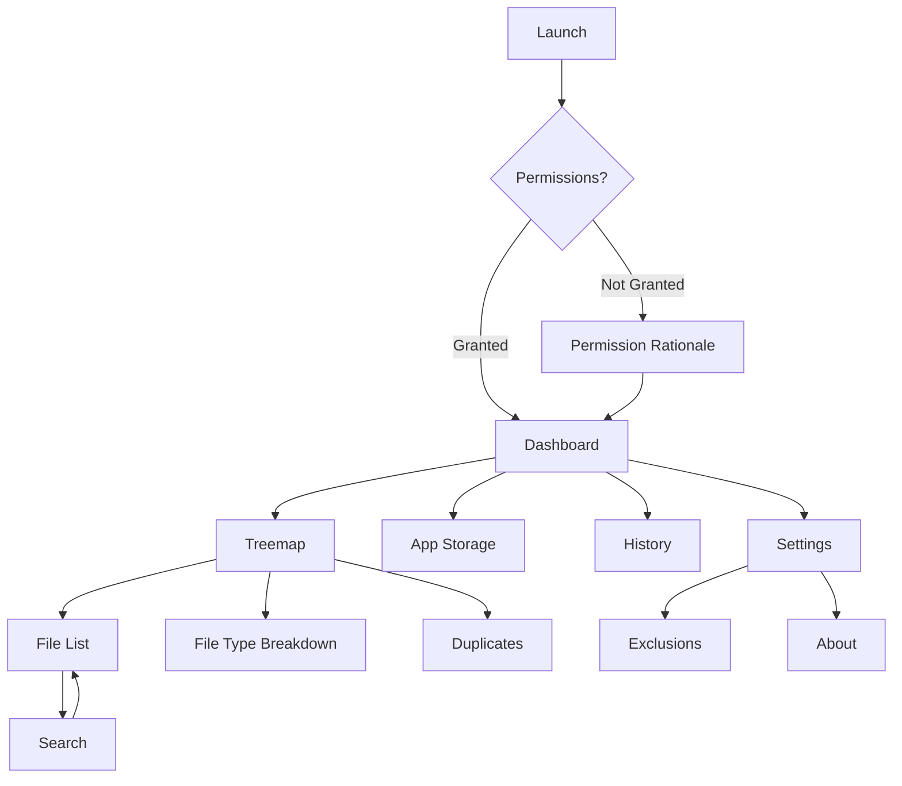

# UI/UX Documentation

This document provides detailed specifications for all 13 screens in Adirstat.

---

## Screen List

1. [Permission Rationale Screen](#1-permission-rationale-screen)
2. [All Files Access Screen](#2-all-files-access-screen)
3. [Dashboard / Partition Overview Screen](#3-dashboard--partition-overview-screen)
4. [Scan Progress Screen](#4-scan-progress-screen)
5. [Treemap Screen](#5-treemap-screen)
6. [File List Screen](#6-file-list-screen)
7. [File Type Breakdown Screen](#7-file-type-breakdown-screen)
8. [Duplicate Files Screen](#8-duplicate-files-screen)
9. [App Storage Screen](#9-app-storage-screen)
10. [File Detail Bottom Sheet](#10-file-detail-bottom-sheet)
11. [Scan History Screen](#11-scan-history-screen)
12. [Search Screen](#12-search-screen)
13. [Settings Screen](#13-settings-screen)

---

## 1. Permission Rationale Screen

**Purpose:** Shown on first launch to explain why permissions are needed before requesting them.

### Layout
- **Top:** App logo (96dp) + App name + Tagline
- **Content:** Vertical list of permission cards with icons and explanations
- **Bottom:** Primary CTA button "Grant Access" + Secondary text button "Use Limited Mode"

### Permission Cards (displayed as a vertical list)

| Permission | Icon | Explanation |
|------------|------|-------------|
| All Files Access | `folder_special` | "We need access to all files on your device to show you exactly what's consuming storage — just like WizTree on Windows." |
| Usage Access | `apps` | "We need usage access to show you how much storage each installed app is using." |

### Interactions
- Tapping "Grant Access" initiates permission flow (see PERMISSIONS.md)
- Tapping "Use Limited Mode" bypasses full permissions and enters degraded mode

### Visual Style
- Full-screen modal on first launch only
- Clean white background
- Large touch targets (48dp minimum)
- Card-based layout with 16dp elevation

---

## 2. All Files Access Screen

**Purpose:** Dedicated screen for MANAGE_EXTERNAL_STORAGE permission with instructions.

### Layout
- **Header:** "Allow Access to All Files" title
- **Instruction Card:**
  - Numbered steps with icons
  - Step 1: "Tap the button below to open Settings"
  - Step 2: "Find Adirstat in the list"
  - Step 3: "Toggle on 'Allow access to all files'"
- **Action Button:** "Open Settings" (primary)
- **Alternative:** "I'll use limited mode instead" (text button)

### Visual Style
- Similar to Permission Rationale but focused on single permission
- Includes illustration showing the Settings toggle

### Interactions
- Tapping "Open Settings" launches `ACTION_MANAGE_ALL_FILES_ACCESS_PERMISSION`
- User returns to app; permission status checked on resume
- If enabled, navigate to Dashboard

---

## 3. Dashboard / Partition Overview Screen

**Purpose:** Main entry point showing all storage partitions with usage summary.

### Layout
- **Top App Bar:** Title "Adirstat" + Search icon + Settings icon
- **Content:** Scrollable list of partition cards
- **Bottom Navigation:** Dashboard | Apps | History | Settings

### Partition Card Components
| Component | Description |
|-----------|-------------|
| Partition Icon | Internal: `memory`, SD: `sd_card`, OTG: `usb` |
| Title | "Internal Storage", "SD Card", "USB Drive" |
| Multi-Segment Usage Bar | Horizontal bar showing Apps (green) / Media (red) / Files (blue) / Free (grey) |
| Stats Row | "XX.X GB used of YY.Y GB" + "ZZ.Z GB free" |
| Breakdown Legend | Color-coded legend: Apps, Media, Files, Free |
| Last Scan | "Last scanned: [relative time]" or "Never scanned" |
| Scan Button | TextButton "Scan" or "Rescan" |

### Multi-Segment Storage Bar
The Dashboard displays a multi-segment storage bar that shows the breakdown of storage usage:
- **Apps (Green):** App data and cache from StorageStatsManager
- **Media (Red):** Media files from File API scan
- **Files (Blue):** Other user files from File API scan
- **Free (Grey):** Available storage

> **Note:** The "Apps" segment shows storage from `Android/data` and `Android/obb` directories which are restricted by Android 11+ and cannot be scanned via File API. These values come from `StorageStatsManager`.

### Empty State
If no partitions found (rare): "No storage volumes detected"

### FAB
- Single FAB at bottom-right: "Scan All"
- Scans all partitions sequentially

### Interactions
- Tap partition card → Navigate to Scan Progress → Treemap
- Tap search icon → Navigate to Search Screen
- Tap settings → Navigate to Settings Screen
- Tap Scan All FAB → Scan all partitions

---

## 4. Scan Progress Screen

**Purpose:** Full-screen progress display during storage scan.

### Layout
- **Header:** "Scanning [Partition Name]"
- **Progress Section:**
  - Circular progress indicator (large, 120dp)
  - Percentage text in center
- **Stats Section:**
  - "Files scanned: [count]"
  - "Current folder: [path]" (truncated with ellipsis)
  - "Time elapsed: [mm:ss]"
- **Cancel Button:** Outlined button "Cancel"

### States

| State | Visual |
|-------|--------|
| Scanning | Animated circular progress, updating stats |
| Completed | Success icon, auto-navigate after 1s |
| Error | Error icon, error message, "Retry" button |
| Cancelled | "Scan cancelled" message, "Back" button |

### Interactions
- Tap Cancel → Confirmation dialog → Cancel coroutine → Return to Dashboard
- Auto-navigate to Treemap on completion

---

## 5. Treemap Screen

**Purpose:** Main visualization showing file/folder sizes as interactive treemap.

### Layout
- **Top App Bar:**
  - Back button
  - Breadcrumb navigation: "Home > Downloads > Videos"
  - Search icon
- **Main Area:** Full-screen treemap (Canvas)
- **Bottom Sheet (on tap):** File/folder details + actions

### Treemap Specifications
- **Algorithm:** Squarified Treemap
- **Colors:** Fixed palette by file type (see UI_DESIGN_SYSTEM.md)
- **Minimum block size:** 4dp x 4dp (below this, show "Other")
- **Labels:** Show file/folder name + size inside blocks > 60dp

### Bottom Sheet Content (on block tap)

| Content | Description |
|---------|-------------|
| File name | Bold, 16sp |
| Path | Secondary, 12sp, gray |
| Size | "XX.X GB" or "XX.X MB" |
| Type | File type category |
| Actions Row | [Details] [Share] [Delete] |

### Breadcrumb
- Shows current depth: Home > Downloads > Videos
- Tapping any segment navigates up to that level
- Long-press shows "Go to root" option

### Gestures
- Tap: Open bottom sheet
- Double-tap on folder: Drill into folder
- Long-press: Quick action menu
- Pinch: Zoom in/out
- Two-finger pan: Navigate treemap when zoomed

### Interactions
- Tap block → Bottom sheet with details
- Tap breadcrumb → Navigate up
- Tap search → Navigate to Search Screen

### Virtual Android/data Nodes
The treemap may display virtual nodes representing `Android/data` and `Android/obb` directories. These are shown because:
- Since Android 11, these directories are inaccessible via File API
- Their sizes are obtained from `StorageStatsManager`
- They appear as special nodes with a lock icon indicator
- Tapping shows: "This folder's contents are protected by Android. Sizes shown are from system APIs."

---

## 6. File List Screen

**Purpose:** Sortable, filterable flat list of all scanned files and folders.

### Layout
- **Top Bar:**
  - Back button + Title "Files"
  - Sort button (dropdown)
- **Filter Chips:** Horizontal scroll row (All, Images, Videos, Audio, Documents, Apps, Other)
- **Search Field:** Text field with wildcard/regex toggle
- **List Area:** LazyColumn of file items

### List Item Components
| Component | Description |
|-----------|-------------|
| Leading Icon | File type icon (24dp) |
| Title | File/folder name (max 1 line, ellipsis) |
| Subtitle | Path (max 1 line, ellipsis) |
| Size | Formatted size, right-aligned |
| Date | "Modified: [date]" |

### Sort Options (Dropdown)
- Size (Largest first) — Default
- Size (Smallest first)
- Name (A-Z)
- Name (Z-A)
- Date (Newest first)
- Date (Oldest first)
- Type (A-Z)

### Filter Chips
| Chip | Filters |
|------|---------|
| All | Everything |
| Images | jpg, png, gif, webp, bmp |
| Videos | mp4, mkv, avi, mov, webm |
| Audio | mp3, wav, flac, aac, ogg |
| Documents | pdf, doc, docx, txt, xls |
| APKs | apk, xapk |

### Interactions
- Tap item → Bottom sheet (same as treemap)
- Long-press → Multi-select mode
- Tap sort → Show dropdown
- Tap filter chip → Apply filter

---

## 7. File Type Breakdown Screen

**Purpose:** Horizontal bar chart showing space consumption by file type.

### Layout
- **Header:** "Storage by Type"
- **Chart Area:** Horizontal bars for top 10 file types
- **Legend:** Color-coded with type name, size, percentage

### Bar Chart Specifications
- Horizontal bars, 24dp height
- Labels inside bar (if fits) or outside
- Percentage label on right
- Sorted by size descending

### File Types Displayed
| Type | Color |
|------|-------|
| Images | #4CAF50 (Green) |
| Videos | #F44336 (Red) |
| Audio | #9C27B0 (Purple) |
| Documents | #FF9800 (Orange) |
| APKs/Archives | #795548 (Brown) |
| Code | #00BCD4 (Cyan) |
| Other | #607D8B (Blue-grey) |

### Interactions
- Tap bar → Filter File List to that type
- Tap "View All" → Navigate to full File List with filter applied

---

## 8. Duplicate Files Screen

**Purpose:** Display detected duplicate files with options to delete.

### Layout
- **Header:** "Duplicate Files"
- **Summary Card:**
  - "X duplicate groups found"
  - "Y GB wasted space"
- **List:** Grouped list of duplicate sets

### Duplicate Group Card
| Component | Description |
|-----------|-------------|
| Group Header | "X files, Y GB each" |
| Original File | Marked with "✓ Original" badge |
| Duplicate Files | List with checkboxes |
| Footer | "Wasted: Z GB" + [Delete Duplicates] button |

### Interactions
- Tap checkbox → Select for deletion
- Tap "Delete Duplicates" → Confirmation dialog → Delete selected
- Tap file → Bottom sheet with file details

---

## 9. App Storage Screen

**Purpose:** List all installed apps with storage breakdown.

### Layout
- **Header:** "Apps Storage"
- **Sort Chips:** Total | APK | Data | Cache
- **List:** LazyColumn of app items

### App Item Components
| Component | Description |
|-----------|-------------|
| App Icon | 48dp from PackageManager |
| App Name | Package label |
| Package Name | Secondary, 12sp |
| Mini Stacked Bar | APK (blue) / Data (green) / Cache (orange) |
| Total Size | "X.XX GB" |

### Interactions
- Tap app → Open system App Info (Settings.ACTION_APPLICATION_DETAILS_SETTINGS)
- Long-press → Quick view of sizes

---

## 10. File Detail Bottom Sheet

**Purpose:** Show detailed file/folder information with action buttons.

### Layout (Modal Bottom Sheet)

| Section | Content |
|---------|---------|
| Header | File/folder icon + Name |
| Details | Full path, Size, Type, Modified date |
| Preview | Thumbnail (if image/video) |
| Hash | SHA-256 (optional, computed on demand) |
| Actions | Row: [Open] [Share] [Delete] |

### Actions Behavior

| Action | Behavior |
|--------|----------|
| Open | Intent.ACTION_VIEW with MIME type |
| Share | Intent.ACTION_SEND via ShareSheet |
| Delete | Confirmation dialog → Delete |

### Delete Confirmation
- Title: "Delete [filename]?"
- Message: "This will free up [size]. This action cannot be undone."
- Buttons: "Cancel" (text), "Delete" (destructive)

---

## 11. Scan History Screen

**Purpose:** View past scans and compare storage changes.

### Layout
- **Header:** "Scan History"
- **List:** LazyColumn of history items

### History Item Components
| Component | Description |
|-----------|-------------|
| Date | "March 7, 2026" |
| Partition | "Internal Storage" |
| Stats | "X files, Y folders" |
| Change Indicator | "↑ 2.3 GB" or "↓ 1.1 GB" from previous |
| Total Size | "Used: XX.X GB / YY.Y GB" |

### Empty State
"No scan history yet. Run a scan to see your storage over time."

### Interactions
- Tap history item → Navigate to Treemap for that scan (cached)
- Swipe left → Delete history entry

---

## 12. Search Screen

**Purpose:** Global search across all scanned files.

### Layout
- **Search Bar:**
  - TextField with clear button
  - Wildcard button (toggle)
  - Regex button (toggle)
- **Filter Chips:** Type, Size range, Date range
- **Results:** Same as File List items

### Search Syntax
| Syntax | Example | Description |
|--------|---------|-------------|
| Wildcard | `*.mp4` | Match any extensioncard | `backup |
| Wild_*` | Match prefix |
| Exact | `photo.jpg` | Exact filename |
| Regex | `.*\.jpg$` | Regex pattern (when enabled) |

### Filter Options
- **Type:** Images, Videos, Audio, Documents, APKs, All
- **Size:** Slider (min: 0, max: scanned max)
- **Date:** Date range picker

### Interactions
- Tap result → Bottom sheet
- Tap search → Keyboard appears, focus TextField

---

## 13. Settings Screen

**Purpose:** User preferences and app configuration.

### Layout
- **Header:** "Settings"
- **Sections:** Grouped preference items

### Settings Sections

#### Appearance
| Setting | Type | Options |
|---------|------|---------|
| Theme | Radio buttons | System, Light, Dark, Dynamic Color |

#### Scanning
| Setting | Type | Options |
|---------|------|---------|
| Minimum file size | Slider | 0 KB - 100 MB |
| Exclusion paths | List | Add/remove paths |
| Background scan | Switch | On/Off |
| Scan interval | Dropdown | Daily, Weekly, Monthly |

#### Data
| Setting | Type | Options |
|---------|------|---------|
| Clear scan cache | Button | Action: clear cache |
| Export preferences | Button | Export settings |

#### About
| Setting | Type | Options |
|---------|------|---------|
| Version | Label | "1.0.0" |
| Open source licenses | Link | Show licenses |
| Privacy policy | Link | Show policy |

### Exclusion Path Dialog
- Title: "Add exclusion path"
- Input: TextField with browse button
- Validation: Path must exist

---

## Navigation Structure

---

## Common Components

| Component | Description | Locations |
|-----------|-------------|-----------|
| StorageBar | Horizontal usage bar | Dashboard, History |
| FileTypeIcon | Icon based on extension | File List, Treemap, Search |
| BottomSheet | File details + actions | Treemap, File List |
| SortDropdown | Sort options menu | File List, App Storage |
| FilterChipRow | Horizontal filter chips | File List, Search |
| SearchBar | Search input with options | Search, Treemap top bar |
| EmptyState | No data placeholder | All list screens |
| LoadingState | Progress indicator | All screens |
| ErrorState | Error display | All screens |

---

## Accessibility

- All interactive elements: 48dp minimum touch target
- Content descriptions for all icons
- Support for TalkBack screen reader
- Dynamic text scaling support
- Sufficient color contrast (WCAG AA)
- Reduce motion option respected
